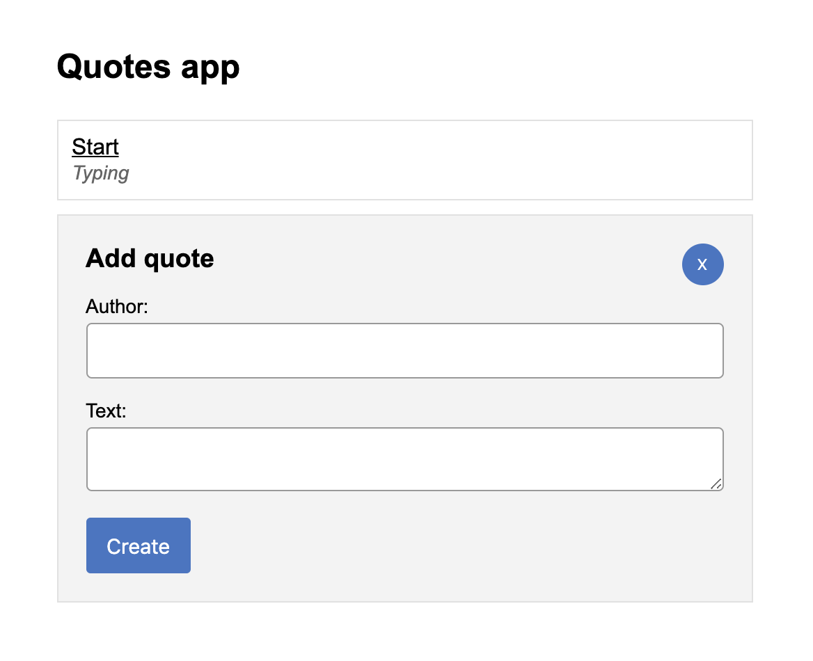
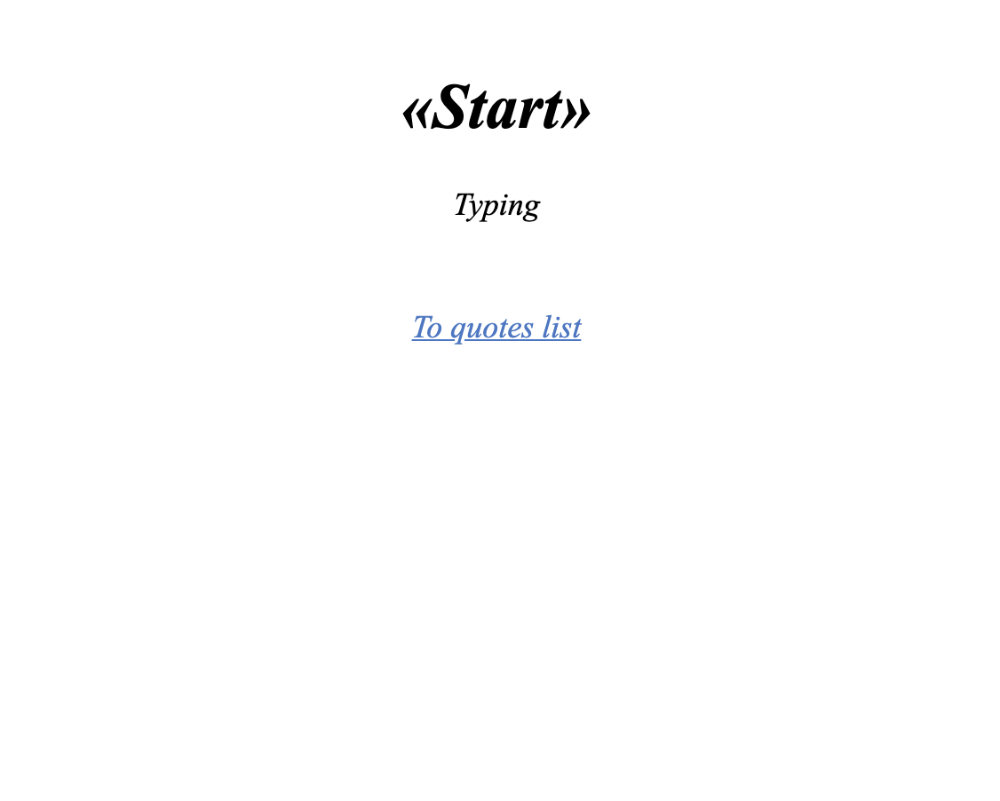

## React testing pyramid

|        Main page (quotes list)      |              Quote page               |
| ----------------------------------- | ------------------------------------- |
|   |   |

### Actions:
1. The quotes list display
2. Open/close the "add quote" form
3. Create new quote (+ form validation)
4. Open the quote page
5. Back to the main page

### Tests (e2e / integration / contract / unit)

#### E2E:

##### [Quotes app:](cypress/integration/app.e2e.ts)

1. A list of quotes should be displayed on the page
2. The created quote should be appended to list
3. Quote page should be opened on click to quote item

#### Integration:

##### [Quote page:](src/components/containers/quotePage/__tests__/quotePage.tsx)
1. Displayed text of quote is correct
2. Displayed author of quote is correct
3. Page should be changed to main on click to "To quotes list"

##### [Main page:](src/components/containers/quotesPage/__tests__/quotesPage.tsx)
1. Title of page contains correct text
2. Quotes list is displayed and count of displayed quotes matches the input data
3. Quote create form is opened by default
4. Form is closing when "X" button is clicked
5. Form is opening when "Create quote" button is clicked

##### [Quotes list:](src/components/pure/quotesList/__tests__/quotesList.tsx)
1. Count of displayed quotes matches the input data
2. Text of first quote is correct
3. Author of first quote is correct
4. First quote item have link to its page

##### [Quote create form:](src/components/pure/quotesList/__tests__/quotesList.tsx)
1. Text of error validation is not displayed by default
2. Validation error is displayed, when:
    1. Author name length less than 2 characters
    2. Text less than 2 characters
    3. Author name length greater than 64 characters
    4. Text length greater than 256 characters
    5. Author is not filled
    6.Text is not filled
3. Validation error is not displayed, when:
    1. length of author name > 2 & < 64 and length of text > 2 & < 256
4. Form submitting
    1. When form is valid
        1. The entered data is sent
        2. Fields of form cleans
    4. When form is not valid
        1. The entered data is not sent

#### Contract:

##### [Quotes API:](src/helpers/quotes/__tests__/quotesHttp.ts)
1. loadQuotesList() - requests a list of quotes
2. loadQuote() - requests quote by id
3. createQuote() - quote creating

#### Unit:

##### [Store middlewares:](src/store/middlewares/__tests__/quotes.ts)
1. Quote creation
    1. A quote should be created on server and be added to store by CREATED_SUCCESS
    2. When server responds error, action CREATED_FAIL should be created
2. Quote fetching
    1. Quote should be fetched from server and be added to store by FETCH_ONE_SUCCESS
    2. When server responds error, action FETCH_ONE_FAIL should be created
3. Quotes list fetching
    1. Quotes list should be fetched from server and be added to store by FETCH_ALL_SUCCESS
    2. When server responds error, action FETCH_ALL_FAIL should be created
    
##### [Store reducers:](src/store/reducers/__tests__/quotes.ts)
1. FETCH_ALL_SUCCESS must replace quotes list in store
2. CREATED_SUCCESS must append quote to the list in store
3. FETCH_ONE_SUCCESS must append quote to the list in store, if quote is not exist in list
4. FETCH_ONE_SUCCESS must do not append quote to the list in store, if quote is exist in list

##### [Store selectors:](src/store/selectors/__tests__/quotes.ts)
1. getQuotesList() - must return list of quotes
2. getQuoteIdMatch() - must return match of quoteId from location, if quoteId is exist
3. getQuoteIdMatch() - must return null, if quoteId is not exist
4. getQuoteIdByLocation() - must return quoteId from location, if quoteId is exist and valid
5. getQuoteIdByLocation() - must return null, if quoteId is not exist in location
6. getCurrentQuoteByLocation() - must return quote from store, if quote with id from location is exist
7. getCurrentQuoteByLocation() - must return null, if quoteId from location is not exist or invalid
8. getCurrentQuoteByLocation() - must return null, if quote with id from location is not exist